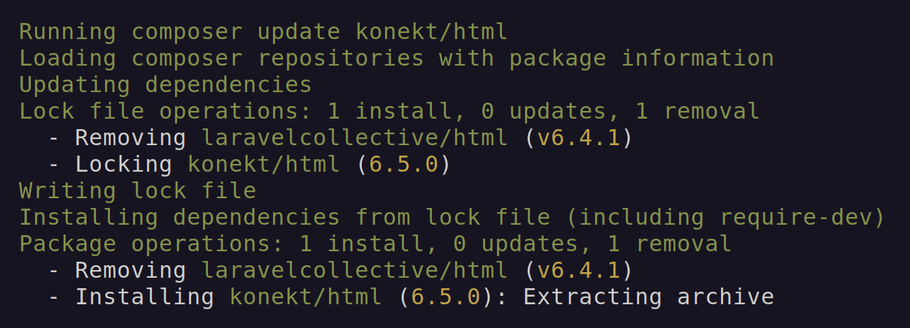

# Laravel 11 Compatible Fork of the LaravelCollective Forms Package

[](https://github.com/artkonekt/html/actions?query=workflow%3Atests)
[](https://packagist.org/packages/konekt/html)
[](https://packagist.org/packages/konekt/html)
[](LICENSE.txt)

This is a fork of the original LaravelCollective HTML package.
It aims to serve as a drop-in replacement after the original package is no longer updated.

The only change this package brings is that it only support PHP 8.1+ and Laravel 10 & 11.

The rest of the functionality is identical with the original one.

## Installation

Run:

```bash
composer require konekt/html:^6.5
``` 

This will replace your existing laravelcollective/html v6.4+ installation with this version:



See the original [Documentation](https://laravelcollective.com/docs) for usage details.
